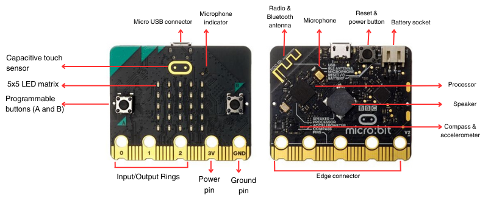
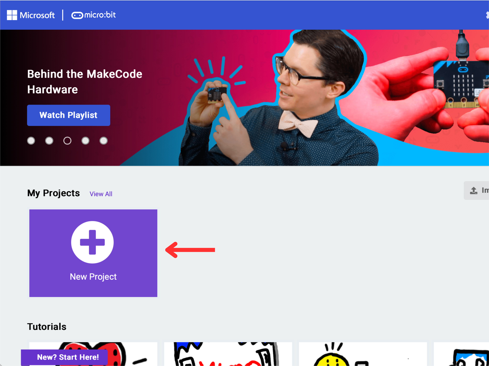
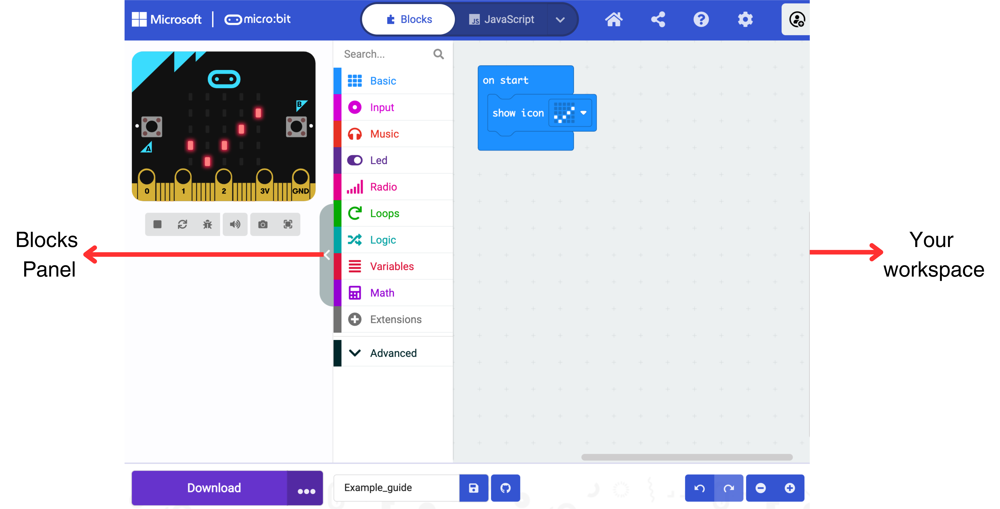

# micro:bit User Guide

This user guide is your key to unlocking a world where learning computer science and electronics is not only educational, but also immensely fun and engaging. Whether you're a student, teacher, or a hobbyist, the micro:bit offers a platform to explore, create, and unleash your creativity.

---

## Introduction: What is a micro:bit?

Designed to make coding accessible, the micro:bit is a great educational tool for learning the fundamentals of software and hardware. The micro:bit is a microcomputer that has an LED light display, buttons, sensors and various input/output features that users can learn how to program and control using block-based or text-based programming tools.

---

## Getting to Know Your micro:bit

The micro:bit is a compact computer equipped with a processor and numerous input/output capabilities. This section will cover the various features of your micro:bit, along with its hardware specifications.

### Features Specifications

- **5x5 LED Matrix**: This array of 25 LEDs on the front of the micro:bit can display text, numbers, and simple images. It's perfect for outputting data, creating simple animations, or even playing basic games.
- **Buttons**: The micro:bit includes one reset button and two programmable buttons, which can be programmed for various functions such as controlling games, triggering events, or navigating through a program.
- **Sensors**
    
    The micro:bit has several built-in sensors:
    
    - **Accelerometer**: Detects and measures movement of the micro:bit in three dimensions. Useful for motion-activated projects, such as creating a tilt-controlled game.
    - **Magnetometer (Compass)**: Detects and measures the Earth's magnetic field, allowing the micro:bit to detect direction. Useful in orientation-based projects or simple navigation tools.
    - **Temperature:** Detects and measures the air temperature. Useful for temperature-based projects such as a thermometer or a simple environment data logger.
    - **Light sensor:** Detects and measures the light level. Useful for light-based projects such as a simple light alarm or a nightlight.
    - **Capacitive touch sensor:**  Detects and measures touch interactions. Useful for touch-enabled projects such as creating a touch-activated display.
- **Input/Output (I/O) Pins**: The edge connector at the bottom of the micro:bit provides 25 external connections, including 2 power rings, 3 General Purpose Input/Output (GPIO) rings, which can be used to connect a wide range of external components like sensors, motors, and more.
- **Wireless Communication**:
    
    The micro:bit has two wireless communication features:
    
    - **Bluetooth Low Energy (BLE)**: Enables the micro:bit to communicate wirelessly with other bluetooth-enabled devices.
    - **Radio**: Allows communication with other micro:bit devices.
- **Sound**
    
    Output
    
    - **Built-in Speaker**: The micro:bit is equipped with a built-in speaker that can be used to produce various sounds.
    
    Input
    
    - Microphone: The micro:bit is equipped with a built-in microphone that can be used to capture and measure sound input.
- **Power Supply Options**: The micro:bit can be powered through USB or an external battery source.
- **USB Interface:** Programs can be downloaded from a computer to the micro:bit with a micro USB.
- **Programming Editors**
    
    The micro:bit supports both block-based and text-based editors.
    
    - **Block-Based Coding**: Ideal for beginners, block-based coding simplifies programming by using color-coded, drag-and-drop blocks that allows users to visually construct the program in blocks.
    - **Text-Based Coding**: For those more experienced, the micro:bit supports text-based programming in various languages such as Python, C++ and more.

### Hardware Specifications

| Processor | [Nordic Semiconductor](https://lancaster-university.github.io/microbit-docs/resources/datasheets/nRF51822.pdf) |
| --- | --- |
| RAM | 128KB |
| Flash ROM  | 512KB |
| Speed  | 64Mhz |
| Bluetooth | Bluetooth 5.1 with Bluetooth Low Energy(BLE) |
| Radio | 2.4GHz  |
| Buttons | 2 programmable buttons (A and B)
1 system button (Power or Reset) |
| Display | 5x5 miniature surface mount red LED  |
| Motion Sensor | [LSM303AGR](https://www.st.com/en/mems-and-sensors/lsm303agr.html) (3 magnetic field and 3 acceleration axes, 2/4/8/16g ranges) |
| Temperature Sensor | On-core nRF52 (range: -40°C to 105°C) |
| Speaker | JIANGSU HUANENG MLT-8530 (SPL: 80dB @ 5V) |
| Microphone | Knowles SPU0410LR5H-QB-7 MEMS (frequency: 100Hz ~ 80kHz)  |
| Edge Connector | 25 Pins in total, including 3 GPIO and 2 power rings, compatible with both 4mm plugs and crocodile clips. For additional details on pinouts, please refer to https://tech.microbit.org/hardware/edgeconnector/. |
| USB Communications | Micro USB 2.0 port |
| Power Supply | 5V  on the USB connector   3V battery plugged into the JST connector |

---

## Setup Guide

This setup guide will walk you through the steps to get you started with your micro:bit. 

To get started, you will need the following:

- micro:bit
- Battery pack
- 2 x AAA batteries

 

<aside>
📝 Note:  These items are provided in the box

</aside>

 

### Powering up the micro:bit

To power up the micro:bit, do the following steps:

1.  Place  2 x AAA batteries in the battery pack.
2. Insert the 2 AAA batteries into the battery pack.
3. Connect the battery pack to the micro:bit's battery socket.

4. Upon successful connection, the LED display on the micro:bit will light up, and you'll be greeted with the 'Meet the micro:bit' program.

 Now, you can start exploring your micro:bit. Interact with the buttons and sensors to discover the various functionalities and features the micro:bit offers.

<aside>
📝 Note: To turn off your micro:bit, simply hold down the reset button for approximately 4 seconds. Alternatively, you can unplug the battery pack to turn off your micro:bit.

</aside>

  

### Coding with micro:bit

To program your micro:bit, you will need the following: 

- micro:bit
- Micro USB cable
- Computer / tablet with internet connection and a USB port

In this tutorial, we will program the micro:bit using Microsoft MakeCode on a computer. Microsoft MakeCode is a web programming platform that is recommended for beginners working with the micro:bit. The MakeCode editor is a block-based coding editor that allows users to construct a program simply by dragging and dropping command blocks. 

For more information on other editors compatible with the micro:bit, please click on this [link](https://microbit.org/code/).

 To start programming with the micro:bit, follow these steps:

1.  Use the micro USB cable to power up and connect the micro:bit to your computer. 

<aside>
📝 Note: Your device should recognize the micro:bit as a removable drive.

</aside>

1. Open a web browser. For the best experience, we recommend using **Edge** or **Chrome** browsers**.** 
2. Navigate to the MakeCode editor website ([www.makecode.microbit.org](http://makecode.microbit.org))
3. In the **My** **Projects** section, click on **New** **Project** to start creating your program.

1.  Enter a name for your project.
2. The blocks panel contain various command blocks to choose from. Drag the selected command block to the workspace to construct your program. 

1. The micro:bit simulator in the editor will simulate the commands laid out in the workspace. This feature allows you to verify that your code functions correctly before you download it to your actual micro:bit device.
2. Click the **Download** button to transfer the program to your micro:bit. Follow the instructions on the pop up window to finish downloading the program to your micro:bit. 

Congratulations, you have successfully programmed your micro:bit!

To discover more about the micro:bit and explore its additional functionalities, please refer to the official micro:bit website (https://microbit.org/). 

---

## Additional Sources

Official support page (https://support.microbit.org/support/home)

Project examples (https://microbit.org/projects/make-it-code-it/)

The micro:bit developer community(https://tech.microbit.org/)

The micro:bit official user guide (https://microbit.org/get-started/user-guide/introduction/)